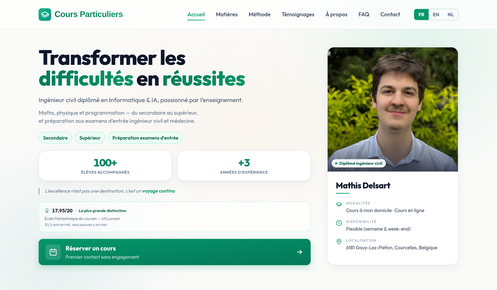

<div align="center">

# Cours Particuliers — Private Tutoring Website

**A bilingual (FR / EN), responsive single-page website for a private tutor — secondary school, higher education and entrance-exam preparation — built with Next.js and statically deployed to GitHub Pages.**

Website: **[mathisdelsart.github.io/private-tutoring](https://mathisdelsart.github.io/private-tutoring)**

[](https://nextjs.org/)
[](https://www.typescriptlang.org/)
[](https://tailwindcss.com/)
[](https://pages.github.com/)

</div>

---



---

## Features

- **Bilingual (FR / EN)** — instant client-side language switch, French by default, preference saved in the browser.
- **Sober, responsive design** — clean white / slate / emerald theme, mobile-first, accessible.
- **Subjects by audience** — an animated segmented control switches between secondary school, higher education and entrance-exam preparation.
- **Smart contact form** — multi-step form, level-aware subject picker, pre-fills a ready-to-send WhatsApp or email message.
- **Testimonials carousel** — autoplaying, pauses on hover, swipeable on touch screens.
- **FAQ accordion** — smooth open/close, also exposed to search engines as `FAQPage` structured data.
- **Motion that stays sober** — scroll reveal, reading-progress bar, active nav link and animated hero counters, all in plain CSS + `IntersectionObserver` (no animation library).
- **SEO-ready** — metadata, Open Graph tags and JSON-LD structured data.
- **Static export** — fast, secure and free to host on GitHub Pages.

Every animation honours `prefers-reduced-motion`, and the scroll reveal falls back to fully visible content when JavaScript is unavailable.

## Tech Stack

| Layer | Technology |
| --- | --- |
| Framework | Next.js 14 (App Router) |
| Language | TypeScript |
| Styling | Tailwind CSS |
| Icons | Lucide React |
| Hosting | GitHub Pages (static export) |
| CI/CD | GitHub Actions |

## Getting Started

```bash
# Clone and install
git clone https://github.com/mathisdelsart/private-tutoring.git
cd private-tutoring
npm install

# Run the dev server
npm run dev
```

Then open [http://localhost:3000](http://localhost:3000).

```bash
# Production build (static export to ./out)
npm run build
```

## Project Structure

```
app/
  layout.tsx          Root layout, fonts and SEO metadata
  page.tsx            Home page (assembles all sections)
  globals.css         Global styles, theme tokens and animations
  icon.svg            Favicon
components/            UI sections (Hero, Method, Services, Testimonials, Faq, Contact, ...)
  Counter.tsx         Number that counts up when it scrolls into view
  SmoothScroll.tsx    Anchor scrolling and scroll-reveal observer
lib/
  i18n.tsx            Language context (FR / EN, persisted)
  assetPath.ts        GitHub Pages basePath helper
locales/
  translations.ts     All UI copy, in both languages
data/
  prof.json           Tutor identity, contact details and SEO metadata
  testimonials.json   Testimonials (author + avatar)
.github/workflows/
  nextjs.yml          Automated GitHub Pages deployment
```

## Configuration

Content is data-driven, so no component edits are needed for everyday updates:

- `data/prof.json` — name, contact info and SEO metadata.
- `data/testimonials.json` — testimonials (author name and avatar initial).
- `locales/translations.ts` — every piece of on-screen text, in French and English.

## Deployment

The site is deployed automatically to **GitHub Pages** via GitHub Actions: every push to `main` triggers a static build and publish (`.github/workflows/nextjs.yml`). In the repository, set **Settings → Pages → Source** to **GitHub Actions**.

---

<div align="center">

**Mathis Delsart** &nbsp;·&nbsp; [github.com/mathisdelsart](https://github.com/mathisdelsart)

</div>
